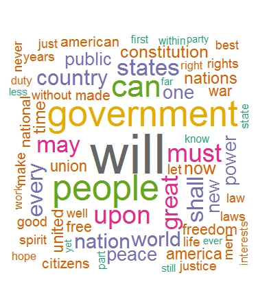
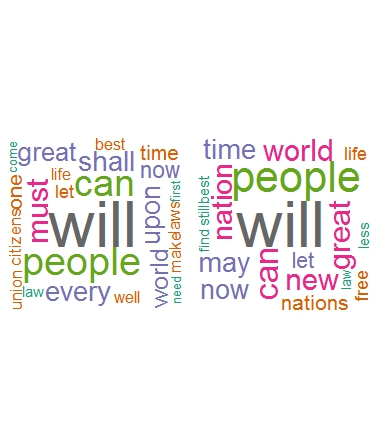
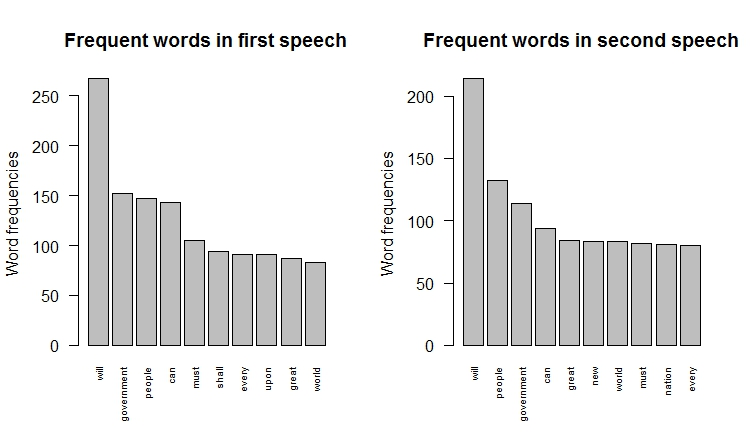
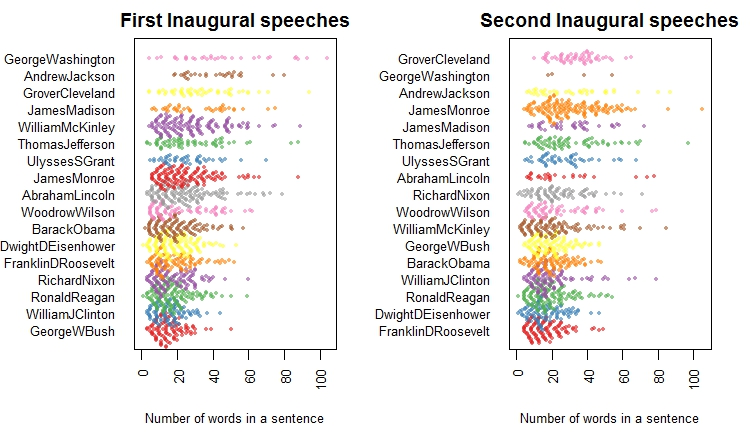
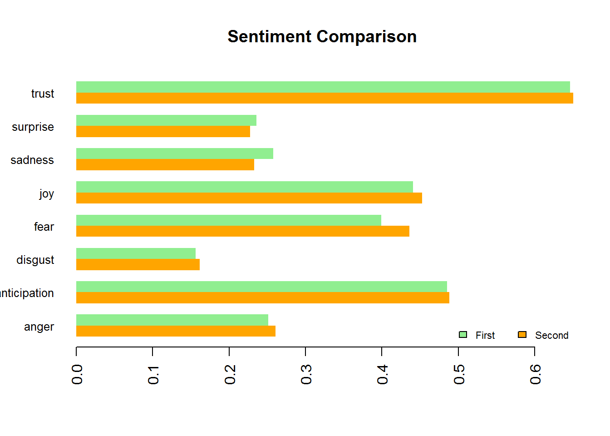
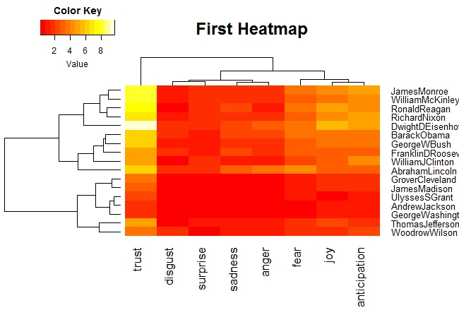
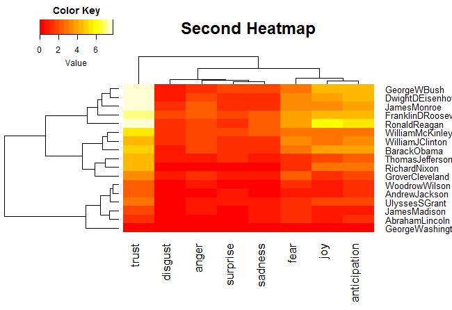
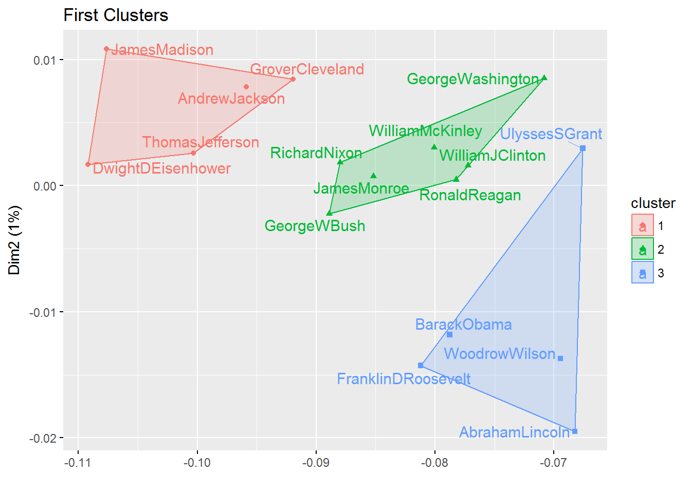
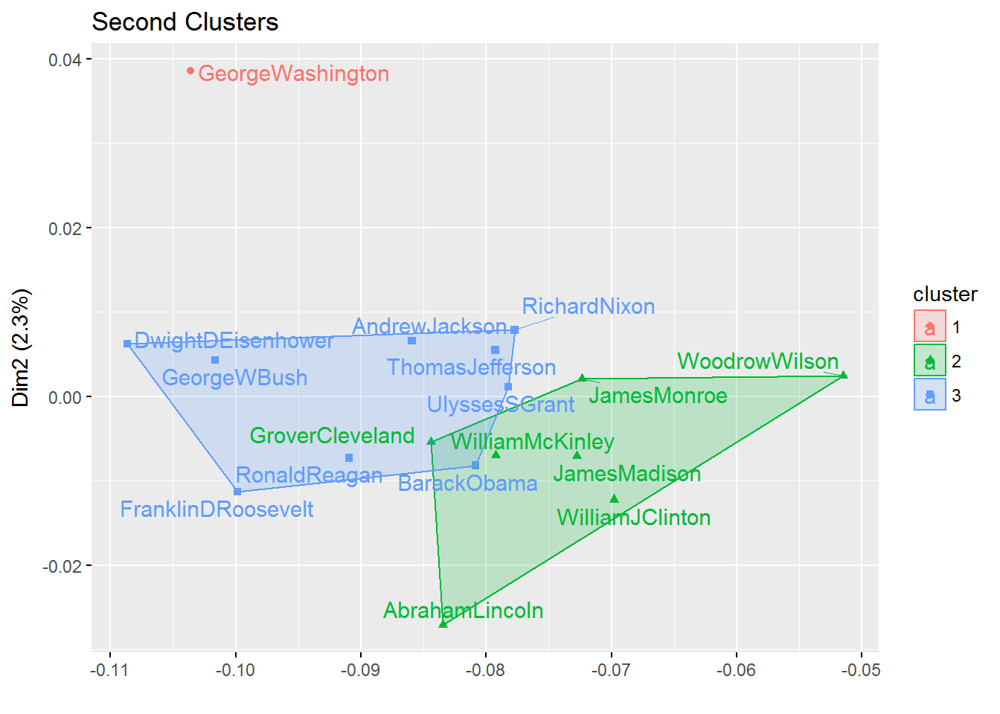
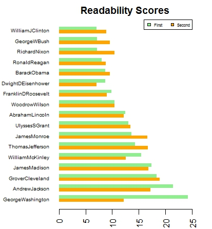

# Fall 2017
# Project 1: Did US Presidents Change Speaking Styles During their Second Inauguration?

### [Project Description](doc/)
This is the first and only *individual* (as opposed to *team*) this semester. 

Term: Fall 2017

+ This project is conducted by Xinyao Guo(xg2257)

+ Project summary: The inauguration speeches are one of the most popular topics to do speech analysis. In this project, we will look at those president who served more than one term and apply text mining as well as natural language processing to analyze their first two inaugural speeches. This report will focus on analyzing inaugural speeaches based on word, sentence, emotion and readability analysis.


Following [suggestions](http://nicercode.github.io/blog/2013-04-05-projects/) by [RICH FITZJOHN](http://nicercode.github.io/about/#Team) (@richfitz). This folder is orgarnized as follows.

```
proj/
├── lib/
├── data/
├── doc/
├── figs/
└── output/
```

##  What words did presidents usually say?
###  Inspect an overall wordcloud


We could get a general sense about what U.S. presidents talked about during their inauguration. We wil focus on a smaller subset of the 17 presidents who served more than once in our next step. 

### Inspect Word clouds for first vs. second term inaugural speeches


The two pictures do not look very different from the first overall word cloud, which is a good thing since the 17 presidents we picked are not outliers.

By comparing these two word clouds, we could get a sense that several new words appeared in the second-term speeches whereas some others disappear. To better inspect on individual words, we will take a look at the summary of top used words in the next step.

### Find the most frequent words


We can see some words became more popular in the second speeches: "new", "peace", "freedom", "war". In the meantime, some words like "country" and "public" lost their popularity. Soley based on this finding, we could make a guess that presidents were more concerned with bigger/worldwide problems during their second term. This is consistent with them being voted for the second time and became more confident in making a bigger influence in the whole world.

## Sentences Analysis
### Sentence length in first vs. second term speeches:

We ordered the plots by sentences lengh. We can see from the plots that James Monroe, Richard Nixon, George W. Bush used longer sentences in the second speech; William McKinley used shorter sentences in the second speech. One interesing finding is that George Washington, Andrew Jackson and Grover Cleveland used the longest sentences in both terms. We will further analyze and try to explain this finding by looking at the emotions expressed as well as the grade level of speeches.

## Sentiment Analysis
### Emotions Comparison




From the barplot and the heat maps, we can see almost every president emphasized on expressing the emotion of trust. This make sense since they want the genreal public be willing to follow them. Aside from trust, positive emotions like anticipation and joy are common in inaugural speeches. From the comparison between heat maps, we can tell presidents changed their emotional expressions from their first to second inauguration moderately. 

### Clustering based on Sentiment Analysis



According to the output, the most positive presidents are Dwight D.Eisenhower and Ronald Reagan. The most negative presidents are Abraham Lincoln and Franklin Roosevelt.

To get a better understanding of who expressed similar emotions, we can take a look at the clustering plots. In terms of the first-term inaugural speeaches, every president as fitted in one of the three clusters according to their use of emotions, and the three clusters are fairly distinct. However in the second-term speech, two of the clusters have some overlap and George Washington seems to be an outlier who did not belong to any of the cluster. To verify this, I also changed the number of clusters (k) to 4 and 5, George Washington still seems to be far apart from others. Next, let's do further analysis on readability to see if the level of readability score changes and to see if George Washington is really an outlier.

## Readability Analysis
Readability is an approximation of the ease with which a reader parses and comprehends text. We can see the scores as grade levels. We are interested in each president's grade level or the difficult level of their speeches. To quantify readility scores, we use the Automated Readability Index(ARI) built in the koRpus pacakge.


From the output, the readability score of George Washington decreases significantly. This might explain the fact that he was an outlier in terms of sentiment clustering. We can see that George Washington, Andrew Jackson and Richard Nixon's readability scores vary a lot from their first to second term inauguration speech. 

Overall, the average readability score did not change much, which indicates most presidents did not change their speaking styles a lot from their first term inaugration.

## Conclusion
We analyzed the inaugural speeches for the U.S presidents who served more than one term. In terms of words, we could see that on average, presidents had wider perspective and became more confident in delivering speeches.

In terms of sentences, most presidents sticked to similar sentences length from the first speech. Several changed their speaking styles by using longer or shorter sentences. George Washington, Andrew Jackson and Grover Cleveland used the longest sentences in both terms.

In terms of emotion, the most popular emotion that almost every president emphasized is trust. Aside from trust, presidents tended to  changed their speaking styles by changing their emotions moderately. One interesting finding is that George Washington was very different from others during his second inaugural speech. 

In terms of readability, most presidents did not have a very different readability score as compared to their scores for the first term. George Washington had the highest score in his firt speech but it decreased significantly during his second speech. In addition, Andrew Jackson, Grover Cleveland and James Madison have high readability scores, which is also consistent with the fact that these people use the longest sentences.

Therefore, presidents change their speaking styles in terms of word choice, perhaps due to the contemporary issues around the world. In terms of sentence length, emotion expression and readability, most presidents did not change their speaking style much since these might be deep-rooted in one's speaking habit. However, George Washington seems to be a special case. 


### References 
http://www.sthda.com/english/wiki/text-mining-and-word-cloud-fundamentals-in-r-5-simple-steps-you-should-know
http://anythingbutrbitrary.blogspot.com/2014/01/statistics-meets-rhetoric-text-analysis.html

